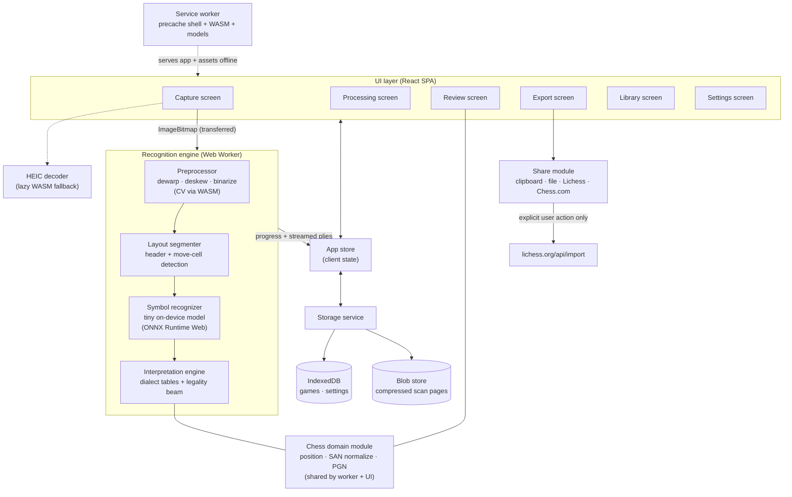
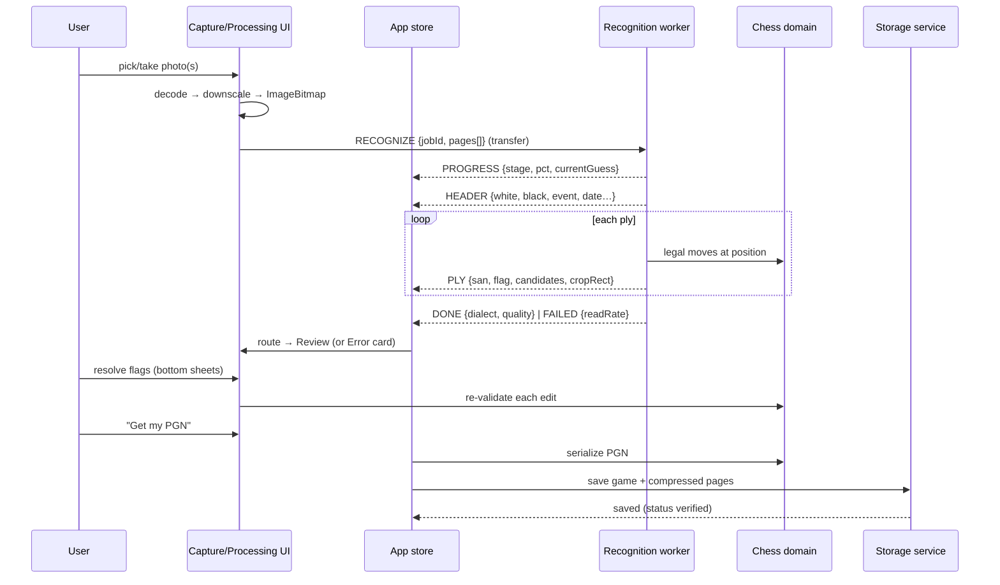

# ScoreSnap — Front-End System Design

|            |                                                                                                                                                                                                                                                      |
| ---------- | ---------------------------------------------------------------------------------------------------------------------------------------------------------------------------------------------------------------------------------------------------- |
| **Status** | v1.0 — companion to [PRD.md](./PRD.md)                                                                                                                                                                                                               |
| **Date**   | 2026-08-23                                                                                                                                                                                                                                           |
| **Format** | [RADIO framework](https://www.greatfrontend.com/front-end-system-design-playbook/framework) (greatfrontend.com): Requirements exploration → Architecture / high-level design → Data model → Interface definition (API) → Optimizations and deep dive |

A note on the format: RADIO assumes a client talking to a server. ScoreSnap is deliberately **client-only** — there is no backend, so "Source: server" collapses out of the data model, and the interface section defines worker protocols and module contracts instead of REST endpoints (plus the one external HTTP API used for sharing). Product-level decisions are settled in the PRD; requirement IDs (F-x / N-x) below refer to it.

---

## 1. Requirements exploration

### Core functional requirements

- Photograph or import a handwritten chess scoresheet (1–n pages) and produce a standard PGN in which **every move is legal in sequence**.
- Recognition runs **entirely on-device, offline** (no cloud inference — PRD principle #1/#2).
- Review loop with three flag kinds: auto-fixed / pick-one / ambiguous; auto-acceptance only when legality leaves exactly one reading (F-13).
- English + Spanish notation, auto-detected per sheet with manual override (F-11/F-12).
- Typed/pasted entry through the same pipeline (F-14 in spirit; PRD Flow B).
- On-device library with search, resume-review, and export-all (F-40…F-45).
- Export: copy / .pgn download / Lichess / Chess.com; partial export on irreconcilable games (F-30…F-36).

### Core non-functional requirements

- Installable PWA; full pipeline works offline after first load; **total cached payload ≤ 20 MB, models ≤ 10 MB** (N-1).
- Typical one-page sheet processed in ≈ 15 s on a recent iPhone, UI responsive throughout, cancellable (N-2).
- No network request ever carries user data; share actions are explicit (N-3).
- iOS Safari 16.4+ installed-PWA is the reference target; evergreen desktop browsers (N-4).
- No telemetry (N-6).

### Out of scope (v1)

Board-photo→FEN, PDF import, custom viewfinder, engine-assisted ranking, automated structural repair, desktop three-pane workspace, dark mode (PRD §5.2).

---

## 2. Architecture / high-level design

### Rendering approach

A statically-hosted **SPA** (no SSR — there is no server, and the offline mandate means the app shell is served from the service worker cache anyway). Built as an installable PWA; all heavy computation happens in a **Web Worker** so the main thread never drops frames during recognition.

### Component diagram



### Component responsibilities

| Component                       | Responsibility                                                                                                                                                                                                                                                        |
| ------------------------------- | --------------------------------------------------------------------------------------------------------------------------------------------------------------------------------------------------------------------------------------------------------------------- |
| **UI layer**                    | Six screens mapping 1:1 to the design canvas (PRD §10). Mobile-first; desktop is a responsive arrangement of the same components.                                                                                                                                     |
| **App store**                   | Single client store holding the active game draft, recognition job state, and UI state. The only writer of persisted data via the storage service.                                                                                                                    |
| **Recognition engine (worker)** | The whole pipeline off the main thread: geometry correction → cell segmentation → per-cell symbol candidates → legality-constrained decoding. Streams per-ply results so the Processing screen shows live progress (F-10).                                            |
| **Chess domain module**         | Pure, dependency-light: board state, legal-move generation (chess.js-class), SAN normalization to English output (F-31), PGN serialization/parsing, dialect tables. Shared by the worker (decoding) and the UI (re-validating user edits, replay board, typed entry). |
| **Storage service**             | Persistence facade over IndexedDB + blob storage; owns compression of scan pages, quota/persistence requests, export-all assembly.                                                                                                                                    |
| **Service worker**              | Precaches app shell, WASM, and model files (content-hashed); cache-first strategy; update-available flow.                                                                                                                                                             |
| **Share module**                | Clipboard writes, .pgn file downloads, Lichess import POST, Chess.com deep link. The only module allowed to touch the network, and only on explicit user action (N-3).                                                                                                |
| **HEIC decoder**                | Lazy-loaded WASM fallback for HEIC files that arrive untranscoded (F-2).                                                                                                                                                                                              |

### Primary data flow — scan a game



Typed entry (Flow B) skips the worker's visual stages: the text goes straight to the interpretation engine + chess domain, then lands in the same Review screen — one pipeline, two entrances.

---

## 3. Data model

All entities are client-originated (there is no server). "Source" therefore distinguishes **persisted** (IndexedDB/blob store, survives restarts) from **ephemeral** (in-memory store only).

| Entity             | Source                       | Belongs to                 | Fields                                                                                                                                                                                                                                                                                |
| ------------------ | ---------------------------- | -------------------------- | ------------------------------------------------------------------------------------------------------------------------------------------------------------------------------------------------------------------------------------------------------------------------------------- |
| **Game**           | Client (persisted)           | Library, Review, Export    | `id`, `createdAt`, `updatedAt`, `status: 'draft' \| 'needs-review' \| 'verified'`, `header: GameHeader`, `dialect: {detected: 'en'\|'es', override?: 'en'\|'es', margin: number}`, `pageIds: string[]`, `plies: Ply[]`, `pgnCache?: string`, `breakAtPly?: number`                    |
| **GameHeader**     | Client (persisted, embedded) | Export                     | `white`, `black`, `event`, `site`, `round`, `result: '1-0'\|'0-1'\|'1/2-1/2'\|'*'`, `date: {raw: string, iso?: string}`                                                                                                                                                               |
| **Ply**            | Client (persisted, embedded) | Review                     | `plyIndex`, `pageIndex`, `cellRect: Rect` (sheet-space, for crops), `rawText`, `candidates: Candidate[]`, `accepted?: {san: string, how: 'auto' \| 'auto-fixed' \| 'user-pick' \| 'typed'}`, `flag: 'none' \| 'auto-fixed' \| 'pick' \| 'ambiguous' \| 'break'`, `confidence: number` |
| **Candidate**      | Client (derived, embedded)   | Review bottom sheet        | `san` (normalized EN), `visualScore`, `priorScore`, `legal: boolean`                                                                                                                                                                                                                  |
| **ScanPage**       | Client (persisted blob)      | Review (photo pane, crops) | `id`, `gameId`, `blob` (grayscale WebP, ~300 KB — F-44), `width`, `height`, `homography: number[9]` (maps cell rects → processed image), `originalDiscarded: true`                                                                                                                    |
| **Settings**       | Client (persisted)           | Settings, Export           | `dateOrder: 'dmy' \| 'mdy'`, `lastEvent?`, `lastSite?`, `dialectFallback: 'en' \| 'es'`, `installNudgeDismissedAt?`                                                                                                                                                                   |
| **RecognitionJob** | Client (ephemeral)           | Processing                 | `jobId`, `stage: 'preprocess' \| 'header' \| 'moves' \| 'legality' \| 'build'`, `pct`, `currentGuess?`, `cancelRequested`                                                                                                                                                             |
| **UIState**        | Client (ephemeral)           | All screens                | `route`, `activeFlagPly?`, `replayPly`, `photoZoom`, `pendingPages: ImageBitmap[]` (multi-page capture before processing — F-4)                                                                                                                                                       |

Notes:

- `plies[].accepted.san` is always **normalized English SAN**; `rawText` preserves what the sheet visually said (`N×c4`), which powers the "sheet says X, but…" explanations in review.
- `pgnCache` is derived and rebuilt on any edit; the plies array is the source of truth.
- Library search (F-41) runs in memory over `header` fields — at club scale (hundreds of games) no index is needed beyond IndexedDB's `updatedAt`/`status` indexes for list ordering and filters.

---

## 4. Interface definition (API)

### 4.1 Recognition worker protocol (postMessage)

| Message     | Direction   | Payload                                                                            | Notes                                                                                       |
| ----------- | ----------- | ---------------------------------------------------------------------------------- | ------------------------------------------------------------------------------------------- |
| `RECOGNIZE` | UI → worker | `{jobId, pages: ImageBitmap[], dialectHint?: 'en'\|'es'}`                          | Bitmaps passed as transferables (zero-copy). `dialectHint` set on override re-runs (F-12).  |
| `PROGRESS`  | worker → UI | `{jobId, stage, pct, currentGuess?: string}`                                       | Drives the Processing screen's live stage list (design 1b).                                 |
| `HEADER`    | worker → UI | `{jobId, header: Partial<GameHeader>}`                                             | Emitted as soon as the header region is read.                                               |
| `PLY`       | worker → UI | `{jobId, ply: Ply}`                                                                | Streamed per move — Review can even be entered while the tail is still decoding.            |
| `DONE`      | worker → UI | `{jobId, dialect: {detected, margin}, quality: {readRate, flagCount}}`             |                                                                                             |
| `FAILED`    | worker → UI | `{jobId, code: 'TOO_BLURRY' \| 'NO_SHEET_FOUND' \| 'INTERNAL', readRate?: number}` | `readRate` feeds the honesty badge ("could read 9 of ~40") on the error card (F-15/Flow C). |
| `CANCEL`    | UI → worker | `{jobId}`                                                                          | Worker aborts at the next stage boundary and discards partials.                             |

### 4.2 Chess domain module (TypeScript contracts)

```ts
// Legality-constrained interpretation of one cell's visual candidates
interpret(
  position: Position,
  rawCandidates: {text: string, visualScore: number}[],
  dialect: Dialect,
): Candidate[]                      // each normalized to EN SAN, legality-checked, prior-scored

// Typed/pasted entry — same engine, no visuals (Flow B; also the PGN import path)
parseTyped(text: string, dialect?: Dialect): {plies: Ply[], header?: Partial<GameHeader>, breakAtPly?: number}

applyMove(position: Position, san: string): Position   // throws on illegal — UI re-validates every edit
toPGN(game: Game): string          // Seven Tag Roster, [Round] tag, partial-export comments (F-31/F-33)
detectDialect(sheetTokens: string[]): {dialect: Dialect, margin: number}   // whole-sheet scoring (F-12)
```

### 4.3 Storage service

```ts
saveGame(game: Game): Promise<void>
getGame(id: string): Promise<Game & {pages: Blob[]}>
listGames(q: {text?: string, filter: 'all'|'verified'|'needs-review'}): Promise<GameSummary[]>
deleteGame(id: string): Promise<void>
deletePagePhotos(gameId: string): Promise<void>        // "delete photo, keep PGN" (F-42)
exportAll(): Promise<Blob>                             // one multi-game .pgn (F-43)
requestPersistence(): Promise<boolean>                 // navigator.storage.persist() (F-45)
```

### 4.4 External HTTP (the only network calls — explicit user actions)

| Method             | Path                                              | Description                                                      | Parameters           | Response                                            |
| ------------------ | ------------------------------------------------- | ---------------------------------------------------------------- | -------------------- | --------------------------------------------------- |
| `POST`             | `https://lichess.org/api/import`                  | Import the finished PGN; open the returned game URL in a new tab | `pgn` (form-encoded) | `{ "id": "...", "url": "https://lichess.org/..." }` |
| `GET` (navigation) | `https://www.chess.com/analysis?pgn=<urlencoded>` | Best-effort deep link; URL-length-limited and unofficial         | —                    | — (falls back to copy-PGN + open site, per F-34)    |

Both degrade gracefully offline: the buttons explain and fall back to **Copy PGN**.

### 4.5 Key store actions (UI ↔ store)

`capture/addPage(bitmap)` · `capture/startRecognition()` · `review/acceptCandidate(plyIndex, san)` · `review/typeMove(plyIndex, text)` · `review/overrideDialect(d)` (re-dispatches `RECOGNIZE` with hint) · `export/updateHeader(patch)` · `game/save()` · `library/search(q)`

---

## 5. Optimizations and deep dive

### 5.1 Deep dive: legality-constrained decoding (the engine that makes weak OCR strong)

The recognizer never has to solve "read arbitrary handwriting." At any position there are only **~35 legal moves**, so decoding is framed as _choosing among legal moves given the strokes_, not transcribing free text:

1. Symbol recognizer emits top-k raw strings per cell with visual scores.
2. Each raw string is aligned against the legal-move set under the active dialect (piece-letter table + glyph equivalences: `×`→`x`, `0-0`→`O-O`, fileless captures like `ed4`, promotions `e8Q`/`e8=D`).
3. Candidate score = α·visual + β·priors, where priors are only the never-lying kind: a written `+` must give check, `#` must mate, opening-frequency tables for early plies (F-14). **Priors never trigger auto-acceptance** — only legality uniqueness does.
4. A small beam over board states carries forward the top interpretations. The beam is usually width 1; it widens exactly at ambiguous plies (h6 vs b6) so a later move can retroactively disambiguate an earlier one.
5. Dead end (no legal continuation at ply _n_) → backtrack to the most recent low-margin ply and try its runner-up; if the beam exhausts, mark `breakAtPly` and stop verifying (F-15) — never fabricate.

Cost: ~35 legal moves × k candidates × beam width per ply — microseconds of pure JS per ply. The entire accuracy story lives or dies on this section plus the symbol model; both are exactly what milestone M0 measures.

**Flag derivation** falls out of the search: unique legal reading = accepted (green _auto-fixed_ if the literal text was illegal); several legal readings with a <90% favorite = _pick_; visually indistinguishable legal readings = _ambiguous_ (F-13/F-16).

### 5.2 Deep dive: dialect auto-detection

Score the whole sheet's raw tokens under each dialect: piece-letter frequency likelihood (`C/T/A/D` are un-English; `N/B/K/Q` un-Spanish) + fraction of plies that decode to legal moves. Pick the argmax; store the margin. Low margin → apply `dialectFallback` and visually highlight the EN/ES chip so the user notices (F-12). The `R` collision (Rey vs Rook) is resolved by the rest of the sheet, never by the single ambiguous token.

### 5.3 Performance

- **Main thread stays idle**: the entire pipeline runs in a worker; bitmaps cross via transferables (zero-copy); results stream per ply so the Processing screen renders progress without polling.
- **Model**: int8-quantized, target < 5 MB; ONNX Runtime Web WASM backend with SIMD (the iOS 16.4 floor guarantees it). Character set is tiny (≈ 30 symbols across both dialects), which is why a compact CNN suffices.
- **CV payload**: stock OpenCV.js is ~8 MB — a custom build with only the needed modules (or hand-rolled dewarp/threshold/contours) is an M0 selection criterion against the 20 MB budget (N-1, R5).
- **Images**: downscale to ~2000 px longest edge before the pipeline (accuracy plateaus above that; memory halves); process page-at-a-time and release bitmaps promptly (old-iPhone memory + thermal).
- **Lazy loading**: the capture screen ships with the tiny UI bundle; recognition WASM+model and the HEIC decoder load in the background / on demand — first paint never waits on 10 MB of engine.
- **Library**: in-memory search over summaries; virtualize the list only if it ever matters (hundreds of games is still trivial).

### 5.4 Offline & PWA lifecycle

- Service worker precaches app shell + WASM + model, all content-hashed; cache-first with background revalidation when online.
- Model/WASM versioning is decoupled from app-shell versioning so a copy tweak doesn't re-download 10 MB.
- Update flow: new SW installs silently → non-blocking "update ready" toast → applies on next launch (never mid-recognition).
- `navigator.storage.persist()` requested on first save; un-installed usage shows the durability nudge (F-45); **Export all** is the backup ritual.

### 5.5 Storage & durability

- IndexedDB: `games` store with indexes on `updatedAt` and `status`; `settings` singleton; page blobs in a separate store keyed by `gameId` (bulk delete stays cheap).
- Page compression: processed grayscale → WebP q≈0.7 → ~300 KB (F-44); the homography matrix persists so review crops map correctly forever.
- `QuotaExceededError` on save → keep the game in memory, surface a storage sheet (offer photo deletion / export) — never lose a verified game silently.
- The storage service is deliberately the **sync seam**: if a server ever arrives ([ADR-0001](./adr/0001-client-only-architecture.md)), an E2E-encrypted sync engine bolts on behind this facade — PGN + page blobs as the payload — with nothing above it changing.

### 5.6 Accessibility

- Flags are never color-only: auto-fixed = solid pill + ✓, pick = solid outline + ▾, ambiguous = **dashed** border + ? (shape carries the meaning; the canvas already does this).
- Bottom sheets: focus-trapped, `Esc`/scrim dismiss, focus returns to the triggering chip.
- Move list is a semantic list; VoiceOver reads "move 11, white, rook takes e4, needs review — 3 suggestions."
- ≥ 44 px touch targets (N-5); replay board honors `prefers-reduced-motion`; full keyboard operability at desktop widths (arrow-key replay per design 1c's hint).

### 5.7 Internationalization

- UI copy externalized from day one; English UI at launch, Spanish UI is a fast-follow (the user base that writes `C/T/A/D` reads Spanish).
- Notation dialect (input) is deliberately independent of UI locale — a Spanish-UI user scans English sheets and vice versa.
- Date-order is a first-run setting seeded from locale, not silently inferred per sheet (F-32).

### 5.8 Security & privacy

- CSP: `default-src 'self'`; `connect-src 'self' lichess.org`; no third-party scripts, no CDN assets, **fonts self-hosted** (the design's Google Fonts links are replaced at build time — offline requires it anyway).
- No cookies, no storage of anything off-device, nothing to breach: the threat model is almost entirely "don't add egress by accident," enforced by the Share module being the only fetch site in the codebase (lintable).
- Clipboard writes only via user gesture; graceful message when the Clipboard API is denied.

### 5.9 Error handling & edge cases

| Case                              | Behavior                                                                                                                                                           |
| --------------------------------- | ------------------------------------------------------------------------------------------------------------------------------------------------------------------ |
| Blurry/unusable photo             | Cheap blur gate (variance-of-Laplacian) before the heavy pipeline; below threshold or `readRate` too low → error card with read-rate honesty, three exits (Flow C) |
| Cancel mid-recognition            | Worker aborts at stage boundary; partials discarded; nothing saved                                                                                                 |
| Multi-page abandoned mid-capture  | Pending pages live in ephemeral state only; leaving capture prompts to keep-as-draft or discard                                                                    |
| Irreconcilable game               | `breakAtPly` marks the wall; tail is editable-unverified; partial export with truncation comment (F-33)                                                            |
| HEIC arrives raw (desktop Chrome) | Lazy WASM decode; if that fails, actionable message naming the format                                                                                              |
| Storage full                      | See §5.5 — surface, offer remedies, never silent-drop                                                                                                              |
| Unknown header fields             | PGN conventions: `?`, `????.??.??`, result `*` (F-31)                                                                                                              |

### 5.10 Stack choices (constraints honored, M0 finalizes the recognition pieces)

**Framework: TanStack Start** (decided 2026-08-24), TypeScript + React on the Vite build pipeline, run in **SPA/prerender mode**: the app shell is baked to static HTML at build time and hosted statically; SSR, streaming, and server functions stay switched off per [ADR-0001](./adr/0001-client-only-architecture.md). What v1 actually uses from Start is TanStack Router's type-safe, file-based routing for the six screens plus the client build pipeline; the dormant full-stack capacity (server functions) lines up with the ADR's sync seam if a backend ever arrives. To verify during M1 scaffolding: the PWA/service-worker precache story under SPA mode, and that Start's baseline output leaves room in the ≤ 20 MB budget (N-1).

Around it: Zustand-class store; chess.js-class rules engine; ONNX Runtime Web for the symbol model; CV via trimmed OpenCV.js build or hand-rolled primitives (M0 decides against the size budget); Workbox-class SW tooling; IndexedDB via a thin typed wrapper. Apart from the framework, everything here is swappable — the contracts in §4 are the design; the libraries are details.

---

## Open technical questions (owned by M0)

1. Symbol model: train a tiny CNN on chess-symbol data vs. adapt an existing handwriting model — decided by measured accuracy/size on the fixtures corpus.
2. CV dependency: trimmed OpenCV.js vs. hand-rolled dewarp/segmentation — decided by payload budget and segmentation robustness across sheet layouts (R4).
3. Beam scoring weights (α, β) and the 90% flag threshold — tuned on the corpus; the threshold is a product constant (F-16) but its calibration is empirical.
